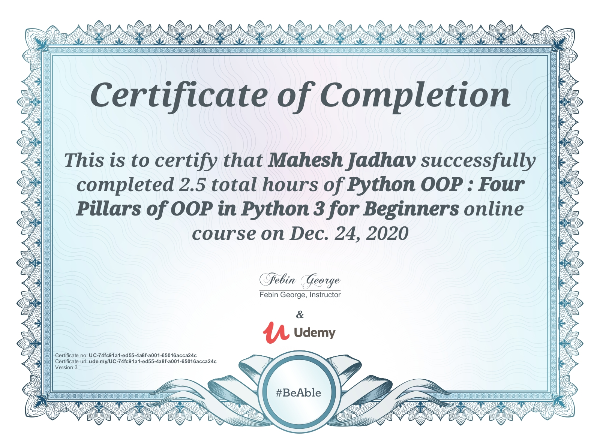

> **Platform** : [Udemy]()

> **Course** : [Python OOP : Four Pillars of OOP in Python 3 for Beginners](https://udemy.com)

> **Instructor** : [Febin George]()

> <a target="_blank" href="https://udemy-certificate.s3.amazonaws.com/image/UC-74fc91a1-ed55-4a8f-a001-65016acca24c.jpg">Certificate Link</a>

> **Certificate** : 

